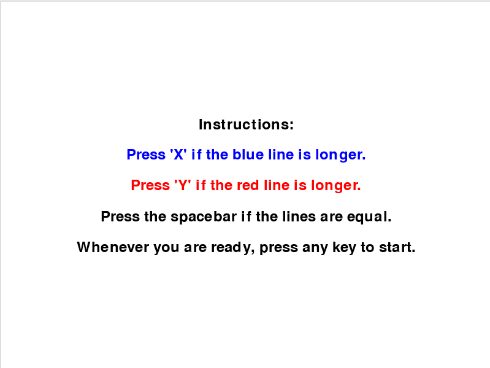
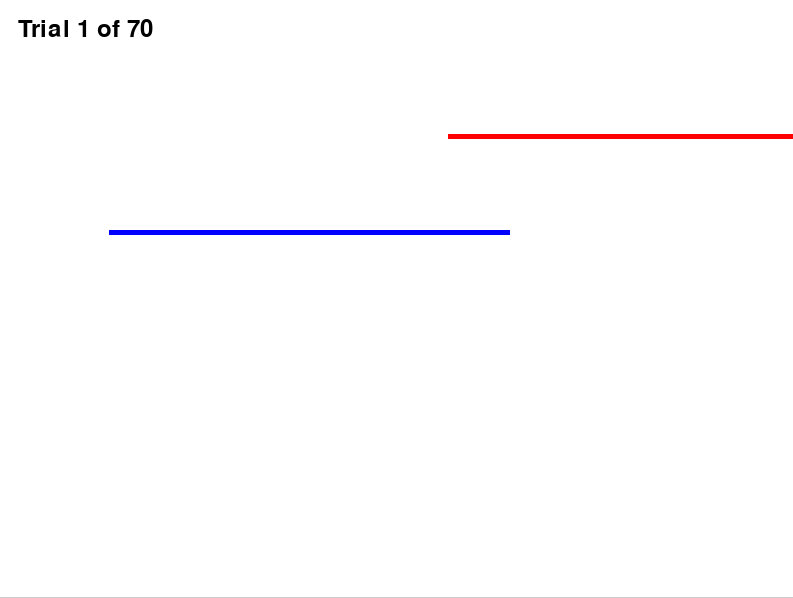
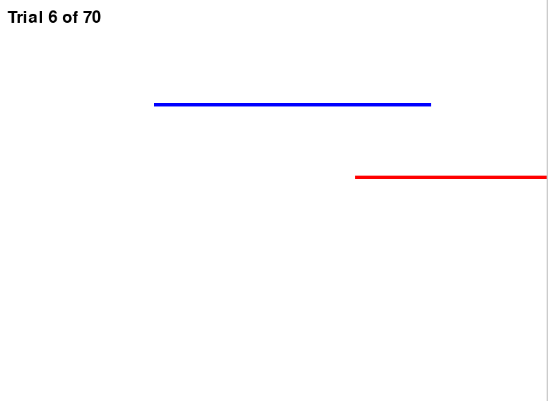
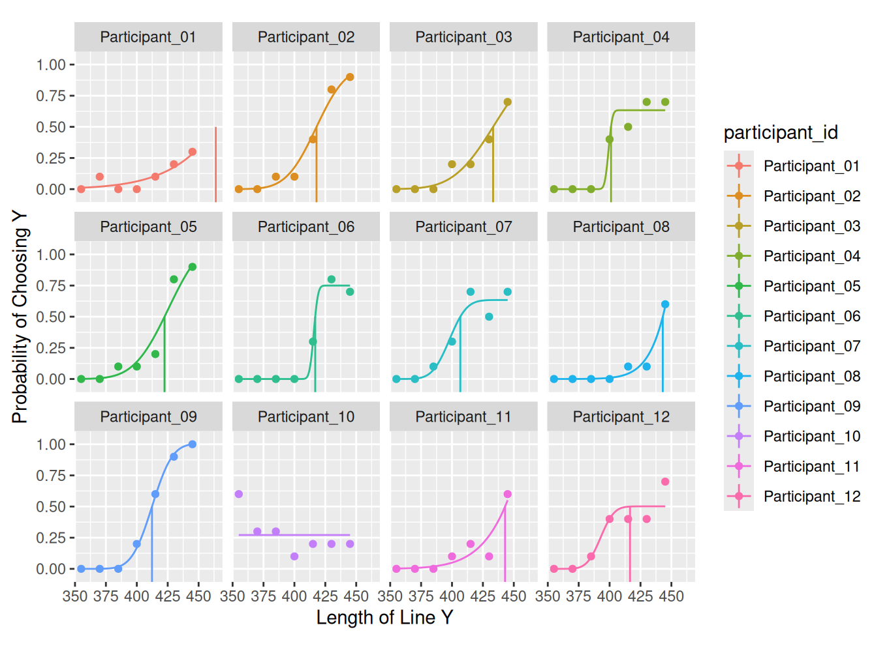

# Introduction
##  What are we studying?

- Just Noticeable Difference (JND)
- The smallest difference in a stimulus that a person can detect.

## Why is this important?

- Fundamental concept in perception
- Applied in:
  - Marketing (product changes)
  - Design (user experience)
  - Everyday perception

## Research Gap

- How accurately can individuals detect small differences in line length?
- Do participants show consistent perceptual sensitivity?

# Materials and Methods
## Participants

- PSYCH 390 students  
- Sample size: 12
- Recruited during Data Collection Day

## Design

- Line Length Comparison Task
- Two lines per trial:
  - Blue line (X) – constant [400]
  - Red line (Y) – varies [355,370,385,400,415,430,445]

- 7 variations of Y:
  - 3 shorter
  - 1 equal
  - 3 longer

## Design 
{width=100%}

## Design Trials

:::: {.columns}

::: {.column width="50%"}
{width=100%}
:::

::: {.column width="50%"}
{width=100%}
:::

::::

## Procedure

1. Participant enters ID  
2. Reads instructions  
3. Completes 70 trials  
4. Responds using:
   - X → blue longer  
   - Y → red longer  
   - Spacebar → equal  

- No breaks  
- Task closes automatically after completion  

# Results
## Results
- X-axis: Length of Y line  
- Y-axis: Probability of choosing Y  

- Trend:
  - As Y increases → probability of choosing Y increases  

- Outliers:
  - Participant 10  
  - Possibly Participant 06  

## Results Graph

# Discussion
## Implications
- Participants generally followed expected perceptual trends
  - People noticing differences when lines are longer
  - But struggling more when lines are around the same lengths

## Limitations

- Participant interface of the study was confusing and could have been clearer:
  - Using X and Y keys for our Blue and Red lines was confusing
- The length of the study might have made people fatigued
- Small sample size (N=12)
- The constant (red) line staying on the right wall the whole time could have influenced perceptions

## Future Implications

- Was suggested it should have been ‘b’ for blue and ‘r’ for red
- Could have also had the instructions stay on screen during the trials 
- Either incorporate breaks or have less trials.
 

## References

- Cherry, K. (2025). Just Noticeable Difference (JND) in Psychology  
- Britt & Nelson (1976). Marketing importance of JND  
- Arfadia (n.d.). Marketing Psychology: JND  
